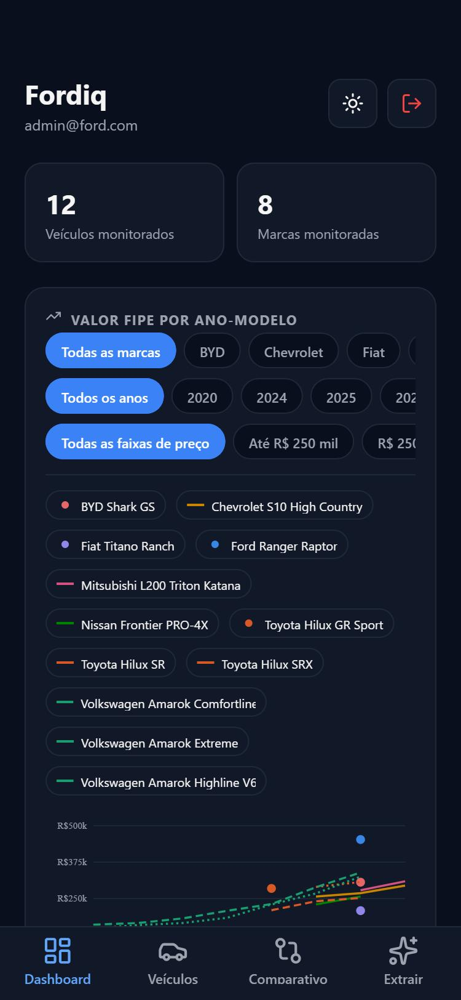
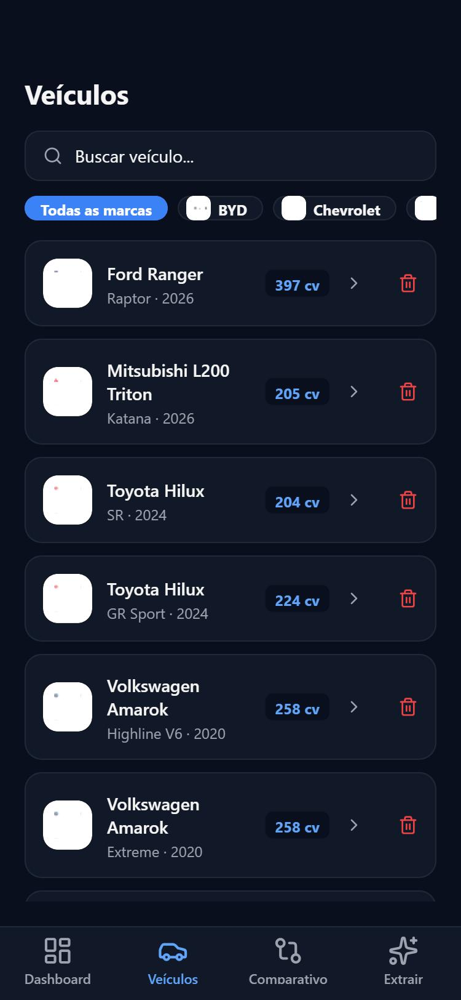
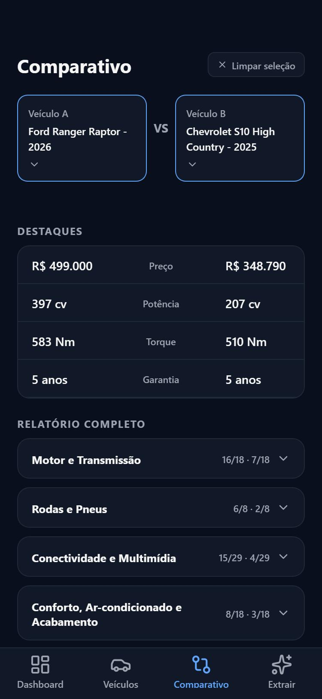
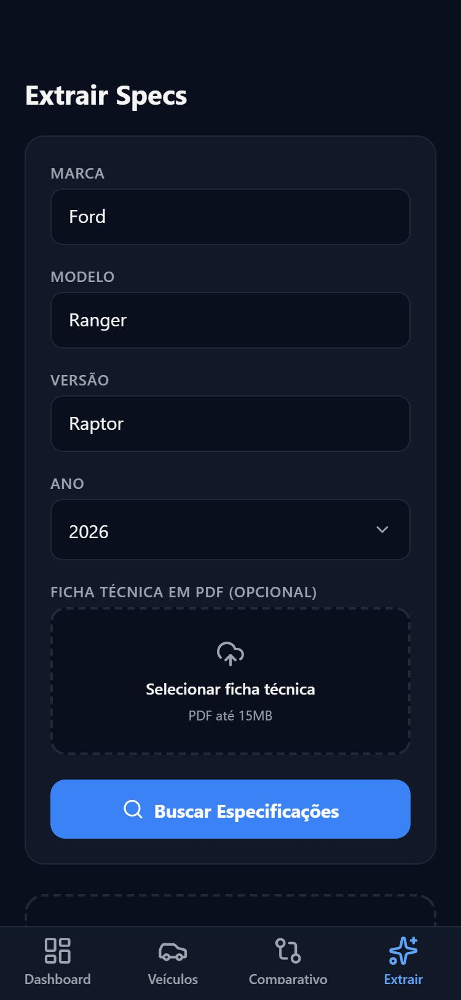

# Fordiq — App mobile

Cliente mobile (Expo + React Native) do Fordiq, a plataforma de Inteligência Competitiva Automotiva do desafio FIAP + Ford. Consome a mesma API Fastify que o app web (`apps/api`), com login por JWT e assinatura HMAC nas rotas de escrita.

## Telas

| Rota | Tela | O que faz |
|---|---|---|
| `app/(auth)/login.tsx` | Login | Autentica com email/senha, guarda os tokens (JWT) em `expo-secure-store` |
| `app/(tabs)/index.tsx` | Dashboard | KPIs de veículos/marcas monitorados, gráfico de preço FIPE por ano-modelo, atividade recente |
| `app/(tabs)/vehicles.tsx` | Veículos | Lista completa com busca e filtro por marca, detalhe da ficha técnica, opção de remover (papel `admin`) |
| `app/(tabs)/extract.tsx` | Extrair | Cadastra um veículo novo via `/extract`, com marca/modelo/versão em texto livre e upload opcional de ficha técnica em PDF |
| `app/(tabs)/compare.tsx` | Comparativo | Compara duas fichas técnicas lado a lado, com destaques e relatório completo por categoria |

Componente compartilhado: `components/SpecReport.tsx` (renderiza a ficha técnica comparável, usado tanto no detalhe de um veículo quanto no comparativo). O app tem alternância de tema claro/escuro (`contexts/ThemeContext.tsx`), com o mesmo tokens de cor do app web.

## Demonstração visual

| Login | Dashboard |
|---|---|
|  |  |

| Veículos | Comparativo |
|---|---|
|  |  |

| Extrair |
|---|
|  |

## Pré-requisitos

- Node.js 20+, pnpm
- App **Expo Go** no celular (Android/iOS) — forma mais rápida de testar sem gerar build nativo — ou um emulador Android/iOS
- A API rodando (`pnpm dev:api` na raiz do monorepo) — veja o [README raiz](../../README.md)

## Configuração

```bash
cp apps/mobile/.env.example apps/mobile/.env
```

Preencha `apps/mobile/.env`:

```env
EXPO_PUBLIC_API_URL=http://localhost:3333/api
EXPO_PUBLIC_HMAC_SECRET=   # idêntico ao HMAC_SECRET de apps/api/.env
```

`localhost` só funciona se você testar pelo navegador (`expo start --web`) ou num emulador rodando na mesma máquina com rede compartilhada. Pra testar num **celular físico** (Expo Go) ou no **emulador Android**, troque por:
- **Emulador Android (Android Studio)**: `http://10.0.2.2:3333/api`
- **Celular físico via Expo Go**: o IP da sua máquina na rede local (aparece no terminal ao rodar `pnpm dev:api`, ex.: `http://192.168.0.10:3333/api`) — celular e computador precisam estar na mesma rede Wi-Fi.

## Rodando localmente

```bash
pnpm install       # na raiz do monorepo
pnpm dev:mobile    # abre o Metro bundler — escaneie o QR code com o Expo Go, ou pressione "a"/"w" pro emulador/web
```

Primeiro acesso: crie um usuário via `POST /api/auth/register` (veja o [README raiz](../../README.md#autenticação)) e faça login com essas credenciais na tela inicial do app.

## Build do APK (Expo EAS)

O projeto já tem `eas.json` configurado com os três perfis (`development`, `preview`, `production`), todos gerando `.apk` (não `.aab`), pronto pra instalar direto num Android sem passar pela Play Store.

```bash
npm install -g eas-cli     # se ainda não tiver
eas login                  # precisa de uma conta Expo (gratuita)
cd apps/mobile
eas build --platform android --profile preview
```

O comando sobe o build pros servidores da Expo e devolve um link pra baixar o `.apk` quando terminar (alguns minutos). Baixe e instale no aparelho (ative "Instalar de fontes desconhecidas" no Android se pedir).

**Atenção**: a API que o app vai consumir no build final não pode ser `localhost` — o dispositivo que rodar o APK não tem acesso à sua máquina. Antes de gerar o build de produção, configure `EXPO_PUBLIC_API_URL` pra apontar pra uma API publicamente acessível (deploy real da API, não um endereço local).

## Limitações conhecidas (vs. o app web)

- O `/extract` não tem a seleção livre de categorias (`categories: string[]`) que o web oferece — a extração mobile sempre busca o conjunto completo de especificações.
- Não existe uma busca "achar no catálogo ou extrair na hora" na tela inicial como no web — no mobile, extrair um veículo novo é só pela aba "Extrair".
- Build nativo (APK) ainda não gerado/testado em dispositivo físico ou emulador — validado até aqui via `expo start --web`.
